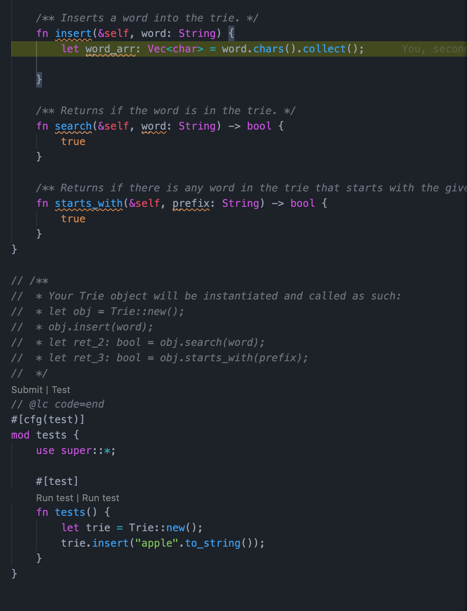

# leetcode

Solve questions in [leetcode](https://leetcode-cn.com/) by Rust

## 前言

由于 Rust 写数据结构相关的资料特别少并且理解非常困难，所以专门建了个 Repo 用来记录 Rust 刷 leetcode 的解法并包含心得体会，欢迎 Star✨ 会长期稳定更新。  
努力写出最容易理解的 Rust 代码。
[https://github.com/zhangyuang/leetcode](https://github.com/zhangyuang/leetcode)

`注: 以下代码并没有刻意追求最优解，主要目的在于熟悉 Rust 语法以及使用可读性强便于理解的代码来解决问题。欢迎 Star✨ 长期稳定保持更新。`

## 相关资料

[官方 API 文档](https://doc.rust-lang.org/std/index.html)  
[Rust 程序设计语言中文版](https://kaisery.github.io/trpl-zh-cn/)

## debug in VSCode

建议本地编码时使用 `VSCode` 自带的 `lldb` 调试功能来进行断点调试，提升开发效率

```json
// setting.json
{
  "version": "0.2.0",
  "configurations": [
    {
      "type": "lldb",
      "request": "launch",
      "name": "Debug",
      "args": [],
      "cwd": "${workspaceFolder}",
      "cargo": {
        "args": [
          "test",
          "--manifest-path=.test_repo/Cargo.toml"
        ],
        "filter": {
          "name": "leetcodebyrust",
          "kind": "lib"
        }
      },
    }
  ]
}
```

`F5/Fn+F5` 启动调试



### lldb 调试 Rust

我们通过 `lldb` 来调试 `Rust` 代码，同样我们会经常需要在 `Debug Console` 中打印出当前的一些变量值。这里需要特殊配置，根据 [VScode LLDB](https://github.com/vadimcn/vscode-lldb/blob/master/MANUAL.md#debug-console) 文档描述 `Debug Console` 提供两种执行模式。分别是以 `lldb commands` 模式执行，或者 `expressions` 表达式的形式执行。

当我们需要进行表达式求值时需要在前面加上 `?` 符号。例如 `?foo` 打印 `foo` 的值。

也可以通过 `settings.json` 中配置 `"lldb.consoleMode": "evaluate"` 默认启用 `evaluate` 模式，不再需要输入 `?` 符号。此时调用 `lldb commands` 需要添加 `/cmd` 开头

## 分类

[链表(linkedList)](#linkedList)  
[二叉树(binaryTree)](#Tree)  
[动态规划(dynamic programing)](#DynamicPrograming)  
[HOT100🔥](#hot100)

### linkedList

链表

#### Rust 解链表题思路

> Go 程序员已经下班
> Cpp 程序员还在打断点
> Rust 程序员还在编译

Rust 解决数据结构问题相比于其他语言十分的困难，就在于变量所有权的 move(转移)与 borrow(借用)。

##### 遍历链表

通常使用可变引用来遍历, 注意这里需要对 `Option<Box<ListNode>>` struct 使用 as_ref 或者 as_mut 来进行引用遍历。根据官方文档的解释，我们可以看出 as_ref/as_mut 在这里的作用是 `Converts from &Option<T> to Option<&T>`。

```rust

let mut root = &mut head;
while let Some(node) = root {
  let next_node = &mut node.next;
  // 使用as_mut获取next_node的引用，使用&mut获取.next的引用。以此来获取root下一个节点的下一个节点的引用。直接使用unwrap会导致所有权的move
  let next_node_next = &mut next_node.as_mut()?.next;
  // 这里面不能再直接使用head，因为head的所有权已经借给了root，在循环体中未归还
  // other code...
  root = &mut node.next;
}

```
写法二

```rust
while head.as_mut()?.next.is_some() {
    head = &mut head.as_mut()?.next;
}
```
##### 转移获取链表节点所有权

- take 方法使用方式见[文档](https://doc.rust-lang.org/std/option/enum.Option.html#method.take)
- Copy 以及 Clone 的区别可查看该[文章](https://zhuanlan.zhihu.com/p/21730929)

```rust

// 因为next为Box智能指针存储在堆上的节点，不具备Copy属性，无法直接从堆上转移数据否则会造成多次释放的问题。使用take方法将所有权转移出去，并且在原位置留下了None。
let next_node = node.next.take();

```

#### 树

Rust 解决 树 题思路

###### 共享树节点

这里我们尽量不使用 clone 或者 take 来重复获取树节点的所有权，这样会导致性能低下以及影响入参树的数据结构, 这里我们使用 Rc::clone

```rust
let root_borrow = root.as_ref().unwrap().borrow();
let left = if root_borrow.left.is_some() {
    Some(Rc::clone(root_borrow.left.as_ref().unwrap()))
} else {
    None
};
let right = if root_borrow.right.is_some() {
    Some(Rc::clone(root_borrow.right.as_ref().unwrap()))
} else {
    None
};
```
#### 解题代码

皆通过 leetcode 测试用例，可直接粘贴到 leetcode 编辑器中调试，刷题建议由浅入深，按知识点来刷,不要左右横跳。

#### Easy

简单难度的链表题

[回文链表|is_palindrome](./linkList/easy/is_palindrome/src/lib.rs)  
[反转链表|reverse_list](./linkList/easy/reverse_list/src/lib.rs)  
[链表的中间节点|middle_node](./linkList/easy/middle_node/src/lib.rs)  
[删除链表节点|delete_node](./linkList/easy/delete_node/src/lib.rs)  
[删除链表重复节点|delete_duplicates](./linkList/easy/delete_duplicates/src/lib.rs)

#### Medium

中等难度的链表题

[两数相加|add_two_numbers](./linkList/medium/add_two_numbers/src/lib.rs)  
[两两交换链表中的节点|swap_pairs](./linkList/medium/swap_pairs/src/lib.rs)  
[删除链表的倒数第 N 个节点|remove_nth_from_end](./linkList/medium/remove_nth_from_end/src/lib.rs)
[合并两个链表|merge_in_between](./linkList/medium/merge_in_between/src/lib.rs)  
[旋转链表|rotate_right](./linkList/medium/rotate_right/src/lib.rs)  
[从链表中删去总和值为零的连续节点|remove_zero_sum_sublists](./linkList/medium/remove_zero_sum_sublists/src/lib.rs)  
[链表中的下一个更大节点|next_larger_nodes](./linkList/medium/next_larger_nodes/src/lib.rs)  
[删除链表重复节点 2|delete_duplicate](./linkList/medium/delete_duplicate/src/lib.rs)


### Tree

树，二叉树

#### 解题思路

Rust 构造树需要使用 [Rc<T>引用计数智能指针](https://kaisery.github.io/trpl-zh-cn/ch15-04-rc.html)以及 [RefCell](https://kaisery.github.io/trpl-zh-cn/ch15-05-interior-mutability.html)，使得一个数据具有多个可变的所有者。因为一个子节点可能被多个父节点所共享。

#### Easy

简单难度的树题
二叉搜索树解题思路：中序遍历的结果是递增数组

[二叉树的层次遍历 II|level_order_bottom](./tree/easy/level_order_bottom/src/lib.rs)  
[二叉树的层平均值|average_of_levels](./tree/easy/average_of_levels/src/lib.rs)  
[相同的树|is_symmetric](./tree/easy/is_symmetric/src/lib.rs)  
[对称二叉树|is_same_tree](./tree/easy/is_same_tree/src/lib.rs)  
[平衡二叉树|is_balanced](./tree/easy/is_balanced/src/lib.rs)  
[二叉树的所有路径|binary_tree_paths](./tree/easy/binary_tree_paths/src/lib.rs)  
[二叉树的最小深度|min_depth](./tree/easy/min_depth/src/lib.rs)  
[左叶子之和|sum_of_left_leaves](./tree/easy/sum_of_left_leaves/src/lib.rs)  
[二叉搜索树中的众数|find_mode](./tree/easy/find_mode/src/lib.rs)  
[二叉搜索树中的搜索|search_bst](./tree/easy/search_bst/src/lib.rs)  
[二叉搜索树的第 k 大节点|kth_largest](./tree/easy/kth_largest/src/lib.rs)  
[二叉搜索树的范围和|range_sum_bst](./tree/easy/range_sum_bst/src/lib.rs)  
[二叉搜索树节点最小距离|min_diff_in_bst](./tree/easy/min_diff_in_bst/src/lib.rs)  
[把二叉搜索树转换为累加树|convert_bst](./tree/easy/convert_bst/src/lib.rs)  
[将有序数组转换为二叉搜索树|sorted_array_to_bst](./tree/easy/sorted_array_to_bst/src/lib.rs)  
[另一个树的子树|is_subtree](./tree/easy/is_subtree/src/lib.rs)  
[叶子相似的树|leaf_similar](./tree/easy/leaf_similar/src/lib.rs)  

#### Medium

中等难度的树题

[二叉树前序遍历|preorder_traversal](./tree/medium/preorder_traversal/src/lib.rs)  
[二叉树中序遍历|inorder_traversal](./tree/medium/inorder_traversal/src/lib.rs)  
[二叉树层次遍历|level_order](./tree/medium/level_order/src/lib.rs)  
[二叉树展开为链表|flatten](./tree/medium/flatten/src/lib.rs)  
[不同的二叉搜索树|num_trees](./tree/medium/num_trees/src/lib.rs)  
[验证二叉搜索树|is_valid_bst](./tree/medium/is_valid_bst/src/lib.rs)  
[二叉树的锯齿形层次遍历|zigzag_level_order](./tree/medium/zigzag_level_order/src/lib.rs)  
[最长同值路径|longest_univalue_path](./tree/medium/longest_univalue_path/src/lib.rs)  
[前缀树|Trie](./tree/medium/Trie/src/lib.rs)  
[从前序与中序遍历序列构造二叉树|build_tree](./tree/medium/build_tree/src/lib.rs)  
[根据前序和后序遍历构造二叉树|construct_from_pre_post](./tree/medium/construct_from_pre_post/src/lib.rs)  
[最大二叉树|construct_maximum_binary_tree](./tree/medium/construct_maximum_binary_tree/src/lib.rs)  
[完全二叉树的节点个数|count_nodes](./tree/medium/count_nodes/src/lib.rs)  


#### Hard

[二叉树后序遍历|postorder_traversal](./tree/hard/postorder_traversal/src/lib.rs)

### DynamicPrograming

动态规划

#### Rust 解动态规划题思路

主要思路与其他语言类似。还是通过寻找状态转移方程(递推关系)，通常要使用 vec 来保存之前的结果来提升性能。
常用到的空间优化方式有滚动数组，来将二维数组压成一维或减少数组空间大小。大部分情况都是背包问题(01背包，完全背包，多重背包)问题的变种。
学习资料: [liweiwei leetcode 经典动规解析](https://leetcode-cn.com/problems/coin-change/solution/dong-tai-gui-hua-shi-yong-wan-quan-bei-bao-wen-ti-/)

#### Easy

简单难度的动态规划题

[爬楼梯|climb_stairs](./dynamic-programing/easy/climb_stairs/src/lib.rs)  
[三步问题|ways_to_step](./dynamic-programing/easy/ways_to_step/src/lib.rs)  
[连续数列|max_sub_array](./dynamic-programing/easy/max_sub_array/src/lib.rs)  
[按摩师|massage](./dynamic-programing/easy/massage/src/lib.rs)  
[打家劫舍|rob](./dynamic-programing/easy/rob/src/lib.rs)  
[使用最小花费爬楼梯|min_cost_climbing_stairs](./dynamic-programing/easy/min_cost_climbing_stairs/src/lib.rs)  
[买卖股票的最佳时机|max_profit](./dynamic-programing/easy/max_profit/src/lib.rs)  
[最长连续递增序列|find_length_of_lcis](./dynamic-programing/easy/find_length_of_lcis/src/lib.rs)  
[区域和检索 - 数组不可变|NumArray](./dynamic-programing/easy/NumArray/src/lib.rs)  
[有序数组的平方|sorted_squares](./dynamic-programing/easy/sorted_squares/src/lib.rs)  
[509 斐波那契数](./dynamic-programing/easy/fib/src/lib.rs)  

#### Medium

中等难度的动态规划题

[最长上升子序列|length_of_lis](./dynamic-programing/medium/length_of_lis/src/lib.rs)  
[最长递增子序列的个数|find_number_of_lis](./dynamic-programing/medium/find_number_of_lis/src/lib.rs)  
[最小路径和|min_path_sum](./dynamic-programing/medium/min_path_sum/src/lib.rs)  
[最长回文子串|longest_palindrome](./dynamic-programing/medium/longest_palindrome/src/lib.rs)  
[打家劫舍 II|robs](./dynamic-programing/medium/robs/src/lib.rs)  
[打家劫舍 III|robs](./dynamic-programing/medium/robs3/src/lib.rs)  
[不同路径 II|unique_paths_with_obstacles](./dynamic-programing/medium/unique_paths_with_obstacles/src/lib.rs)   
[二维区域和检索 - 矩阵不可变|NumMatrix](./dynamic-programing/medium/NumMatrix/src/lib.rs)   
[完全平方数|num_squares](./dynamic-programing/medium/num_squares/src/lib.rs)   
[55跳跃游戏](./dynamic-programing/medium/can_jump/src/lib.rs)   
[45跳跃游戏||](./dynamic-programing/medium/jump/src/lib.rs)   
[413等差数列划分](./dynamic-programing/medium/number_of_arithmetic_slices/src/lib.rs)   

### HOT100🔥

Hot100类型题

#### Easy

简单难度的HOT100题

[柠檬水找零|lemonade_change](./hot100/easy/lemonade_change/src/lib.rs)  
[找到所有数组中消失的数字|find_disappeared_numbers](./hot100/easy/find_disappeared_numbers/src/lib.rs)  
[最短无序连续子数组|find_unsorted_subarray](./hot100/easy/find_unsorted_subarray/src/lib.rs)  
[字符串相加|add_strings](./hot100/easy/add_strings/src/lib.rs)  
[二分查找|binary_search](./hot100/easy/binary_search/src/lib.rs)  
[第一个错误的版本|first_bad_version](./hot100/easy/first_bad_version/src/lib.rs)  

#### Medium

中等难度的HOT100题

[除自身以外数组的乘积|product_except_self](./hot100/medium/product_except_self/src/lib.rs)  
[分割等和子集|can_partition](./hot100/medium/can_partition/src/lib.rs)  
[全排列|permute](./hot100/medium/permute/src/lib.rs)  
[括号生成|generate_parenthesis](./hot100/medium/generate_parenthesis/src/lib.rs)  
[子集|subsets](./hot100/medium/subsets/src/lib.rs)  
[零钱兑换|coin_change](./hot100/medium/coin_change/src/lib.rs)  
[不同路径|unique_paths](./hot100/medium/unique_paths/src/lib.rs)  
[单词搜索|exist](./hot100/medium/exist/src/lib.rs)  
[单词拆分|word_break](./hot100/medium/word_break/src/lib.rs)  
[无重复字符的最长子串|length_of_longest_substring](./hot100/medium/length_of_longest_substring/src/lib.rs)  
[课程表|can_finish](./hot100/medium/can_finish/src/lib.rs)  
[在排序数组中查找元素的第一个和最后一个位置|search_range](./hot100/medium/search_range/src/lib.rs)  

#### Hard

困难难度的Hot100题目

[接雨水|trap](./hot100/hard/trap/src/lib.rs)  

### Others

其他分类的题目集合

#### Easy

[剑指 Offer 21. 调整数组顺序使奇数位于偶数前面|exchange](./others/easy/exchange/src/lib.rs)  
[用栈实现队列|MyQueue](./others/easy/MyQueue/src/lib.rs)  
[用队列实现栈|MyStack](./others/easy/MyStack/src/lib.rs)  
[最小栈|MinStack](./others/easy/MinStack/src/lib.rs)  
[用栈操作构建数组|build_array](./others/easy/build_array/src/lib.rs)  
[判断子序列|is_subsequence](./others/easy/is_subsequence/src/lib.rs)   
[821 字符的最短距离](./others/easy/shortest_to_char/src/lib.rs)  
[997 找到小镇的法官](./others/easy/find_judge/src/lib.rs)   
[118 杨辉三角](./others/easy/generate/src/lib.rs)   


#### Medium

[807 保持城市天际线](./others/medium/max_increase_keeping_skyline/src/lib.rs)  
[11 盛最多水的容器](./others/medium/max_area/src/lib.rs)
[475 供暖器](./others/medium/find_radius/src/lib.rs)


#### Hard

[缺失的第一个正数|first_missing_positive](./others/hard/first_missing_positive/src/lib.rs)  

### 周赛

记录周赛题目

#### 2020.8.9 双周赛

[第 k 个缺失的正整数|find_kth_positive](./weekly-test/2020-08-09/find_kth_positive/src/lib.rs)  
[K 次操作转变字符串|can_convert_string](./weekly-test/2020-08-09/can_convert_string/src/lib.rs)  